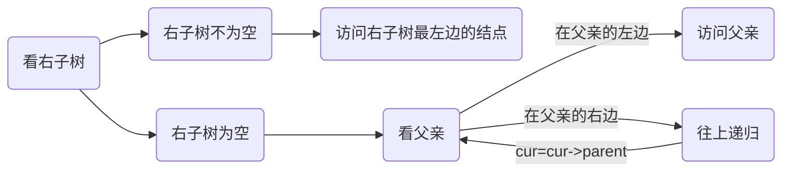

# 🌲一棵红黑树封装出map和set

> 红黑树的模拟实现👉👉[ 传送门_](https://blog.csdn.net/m0_53005929/article/details/124597152?spm=1001.2014.3001.5501)

## 🌴问题

用同一棵红黑树模拟实现map和set的实现过程主要有以下几个问题

1. map的元素是key-value键值对，而set的元素仅仅是key，怎么去用同一棵树封装？
2. 怎么实现这棵树的迭代器？
3. 底层的红黑树也是二叉搜索树，构建二叉搜索树的过程中需要比较，而两个容器的元素类型不同，怎么拿出key-value的key进行比较？

自己碰到的一些小细节

- pair直接赋值报错：尝试引用已删除的函数[C++Error2208:...尝试引用已删除的函数 - 余生以学 - 博客园](https://www.cnblogs.com/2018shawn/p/11819164.html)
- 很多参数没加const修饰，传入的参数却带有const属性，这种情况的报错信息并不会显示和const相关，又因为是语法问题编译不通过，故无法调试（所以处理起来较为麻烦）

## 🌴解决

### 🌵问题一

map的元素是key-value键值对，而set的元素仅仅是key，怎么去用同一棵树封装？

<font color=blue>解决</font>：加一个模板参数（下图中RBTree的第二个参数T）

使用：set实例化红黑树时传入Key，map实例化红黑树时传入KV键值对即可


### 🌵问题二

怎么实现这棵树的迭代器？

> 下面Node表示树的结点

迭代器要去遍历所有元素，还能访问元素的具体内容，类型肯定是Node*(指向树的结点的指针)。

Node的存储不是连续的，不能直接++，也不能直接解引用拿到里面的数据，所以需要重载，所以这里实现迭代器得把Node*封装成一个对象。

此外，vector的迭代器++就是下标+1找到下一个元素，list通过next指针找到下一个结点，那**红黑树的迭代器++要找到下一个结点，那怎么实现**？

- 下一个结点指的是什么?

以整数321456789去构建红黑树，1的下一个就是2,2的下一个就是3。

- 如何实现？

转化一下问题，在一棵二叉搜索树中怎么找到中序遍历的下一个结点？

当前结点记为cur



> 找上一个结点则相反

#### 🍃代码实现

- 为什么传三个模板参数？

区分const迭代器和普通迭代器

```c++
传模板参数时普通迭代器传T&，const迭代器传const T&,同理普通迭代器Ptr传T*，const迭代器传const T*,如果不这么做，这里实现一个普通版本的迭代器，还得再写一个类单独实现const迭代器，重复的代码会比较多
```


```c++
template<class T,class Ref,class Ptr>
//和链表一样的用法，目的是为了区分const迭代器和普通迭代器
struct RBTreeIterator
{
	typedef RBTreeNode<T> Node;
	typedef RBTreeIterator<T, Ref, Ptr> self;
	Node* _node;//结点指针
	RBTreeIterator(Node* node=nullptr)//全缺省
		:_node(node)
	{}

	//const T& operator*()
	// T& operator*() 通过模板的第二个参数简化
	Ref operator*()
	{
		return _node->_data;
	}
	Ptr operator->()
	{
		return &(_node->_data);
	}
	self& operator++()//前置++
	{
		Node* cur = _node;
		if (cur->_right)
		{
			//右子树不为空,不能直接把右子树的根给_node
			//因为右子树最左边的叶子才是下一个应该访问的结点
			Node* right = cur->_right;
			while (right&&right->_left)
			{
				right = right->_left;
			}
			_node = right;
			return *this;
		}
		else//右子树为空
			//看父亲
		{
			Node* parent = cur->_parent;
			while (parent&&parent->_right == cur)
			{
				cur = parent;
				parent = cur->_parent;
			}
			if (parent == nullptr)
			{
				_node = nullptr;
			}
			else
			{
				_node = parent;
			}
			
			return *this;
		}
	}
	self& operator--()
	{
		//前置--
		/*	左子树为空往上面去找
			看父亲cur是父亲的右边直接访问父亲
			cur是父亲的左边代表这颗子树访
			问完毕，往上递归
			左子树不为空访问左子树最右边的结点
		*/
		Node* cur = _node;
		if (cur->_left)//左子树不为空
		{
			Node* left = cur->_left;//左子树 取名改成subRight好一点
			while (left&&left->_right)
			{
				left = left->_right;
			}
			_node = left;
		}
		else//左子树为空
		{
			Node* parent = cur->_parent;
			while (parent&&parent->_left==cur)
			{
				cur = parent;
				parent = cur->_parent;
			}

			_node = parent;
		}
		return *this;
	}
	self operator++(int)
	{
		Node* tmp = _node;
		++(*this);
		return self(tmp);
	}
	self operator--(int)
	{
		Node* tmp = _node;
		--(*this);
		return self(tmp);
	}
	bool operator==(const self& s)const 
	{
		return _node == s._node;//注意这里的s是个对象 不是对象指针
	}
	bool operator!=(const self& s) const
	{
		return _node != s._node;
	}
};
```

### 🌵问题三

set比较时拿到key，map比较时从pair里拿到key?

利用模板+仿函数，即下面的第三个参数

```c++
template<class K,class T,class KeyOfT>
```


仿函数的使用


> 随笔记录：为什么需要第三个参数?
>
> 第三个参数是为了解决第二个参数带来的问题，第二个参数能让红黑树去适配key和key-value，但是因此红黑树也不知道传进来的是什么类型，也就无法进行比较，就得通过仿函数，仿函数是写在map和set里的，map和set是知道确定的类型的，再通过仿函数返回一个要比较的值即可
>
> 为什么需要第一个模板参数K？
>
> find函数需要
>

### 🌵细节

- 

```c++
typedef  typename  RBTree<K, K, setKeyOfT>::iterator iterator;
```

必须加typename告诉编译器后面这一堆是个类型，不然编译器不知道后面的这个是静态成员还是类型

> 不加typename报错
>
> 
>
> [C++typename的由来和用法 ](https://zhuanlan.zhihu.com/p/335777990)

- delete会将对象的这块空间完全释放，但是对象里面开的空间则需要析构函数

  > 具体表现为delete后原属于对象的空间全部变成随机值，就算析构函数里把成员变量置空也仍然会是随机值，因为析构函数是针对对象内部开的空间不针对对象自身的这块空间，对象自身空间的释放由delete完成了

- const pair<K,V>& kv;修饰的引用，意义为不能通过引用来修改kv的值

- 有些参数可以传常量时千万别用变量接收！

- map里的pair<const K,T>  注意K具有const属性

  > 

- map和set插入的返回值是pair<iterator, bool>，通过这个返回值既可以找到插入的元素，还可以知道插入是否成功

- map重载的[]很实用，具体实现是先插入，根据插入的返回值拿到value

  ```c++
  V& operator[](const K& key)
  {
  	pair<iterator, bool> ret = insert(make_pair(key,V()));
  	return (ret.first)->second;
  }
  ```

## 🌴总结

- 红黑树的封装从另一个角度看就是模板的应用

- 迭代器也没那么神奇，本质上也就是一个类

[代码汇总--github](https://github.com/CCLCK/CPP_STL/tree/main/map and set)

## 🌴闲谈

至此模拟实现STL就告一段落了

模拟实现STL代码汇总：[CCLCK/CPP_STL: STL库笔记 (github.com)](https://github.com/CCLCK/CPP_STL)


